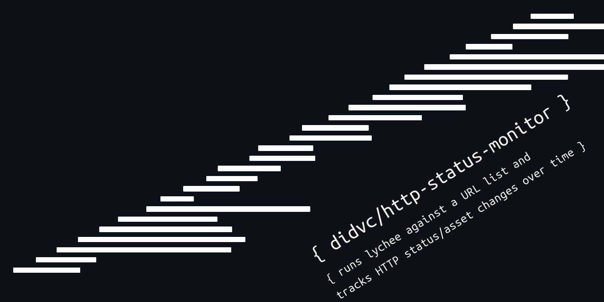

[English](README.md) · [日本語](README-ja.md) · [繁體中文](README-zh-TW.md) · [简体中文](README-zh.md) · [Deutsch](README-de.md) · Français

# http-status-monitor

[](https://didvc.github.io/http-status-monitor/)
[](LICENSE)

[Documentation complète →](https://didvc.github.io/http-status-monitor/)

Un outil en ligne de commande qui exécute [lychee](https://github.com/lycheeverse/lychee) sur une liste d’URL, suit l’évolution des statuts HTTP dans le temps et enregistre des métriques dans un format compatible avec VictoriaMetrics.

L’idée de base : les vérifications superficielles du type « le serveur répond-il ? » ne voient ni le CSS cassé, ni le JS en 404, ni les endpoints d’API morts, que lychee repère en vérifiant chaque ressource liée de la page. Cet outil ajoute à lychee un suivi d’état, pour savoir quand quelque chose change, et pas seulement si le serveur répond.



## Prérequis

- Node.js 18+ avec [tsx](https://github.com/privatenumber/tsx) (`npm install -g tsx`)
- Binaire lychee : à télécharger depuis les [releases de lycheeverse/lychee](https://github.com/lycheeverse/lychee/releases) et à placer dans `./lychee-x86_64-unknown-linux-musl/lychee` (ou ailleurs, puis indiquer `--lychee-path`)

## Installation

```sh
git clone https://github.com/didvc/http-status-monitor
cd http-status-monitor
npm install
```

Téléchargez lychee et rendez-le exécutable :

```sh
mkdir -p lychee-x86_64-unknown-linux-musl
curl -L https://github.com/lycheeverse/lychee/releases/latest/download/lychee-x86_64-unknown-linux-musl.tar.gz \
  | tar xz -C lychee-x86_64-unknown-linux-musl
```

## Utilisation

```
tsx http-status-monitor.mts [options]
```

### Options

| Option | Défaut | Description |
|---|---|---|
| `--urls-file <path>` | `./urls.txt` | Fichier avec une URL par ligne |
| `--urls <url,...>` | - | URL en ligne, séparées par des virgules (prioritaire sur `--urls-file`) |
| `--lychee-path <path>` | auto | Chemin explicite du binaire lychee |
| `--verbose`, `-v` | off | Afficher la sortie de lychee et tous les résultats |
| `--diff` | off | Afficher un diff unifié quand l’état change |
| `--interval <secs>` | `3600` | Intervalle de sondage en mode surveillance |
| `--once` | off | Une seule exécution, puis sortie |
| `--victoriametrics` | off | Ajouter les métriques à `./data/victoriametrics/[yyyy-mm]/results.jsonl` |
| `--wait <secs>` | `1` | Délai entre deux vérifications d’URL |

### Exemples

Première exécution (un nouvel état est enregistré pour chaque URL) :

```
$ tsx http-status-monitor.mts --once --urls-file ./urls.txt --verbose
lychee: ./lychee-x86_64-unknown-linux-musl/lychee
Checking https://example.com/ ...
[NEW    ] https://example.com/  94ff97988565
Checking https://blog.example.com/ ...
[NEW    ] https://blog.example.com/  c2d3b2b59402
```

Deuxième exécution (aucun changement) :

```
$ tsx http-status-monitor.mts --once --urls-file ./urls.txt --verbose
lychee: ./lychee-x86_64-unknown-linux-musl/lychee
Checking https://example.com/ ...
[ok     ] https://example.com/  94ff97988565
```

Détecter un changement avec `--diff` :

```
$ tsx http-status-monitor.mts --once --diff --urls "https://blog.example.com/"
[CHANGED] https://blog.example.com/  1ed4abbb500c
Index: https://blog.example.com/
===================================================================
--- https://blog.example.com/	previous
+++ https://blog.example.com/	current
@@ -3,7 +3,7 @@
   "error_map": {
     "https://blog.example.com/": [
       {
-        "url": "https://example.com/cdn-cgi/l/email-protection#5137243c382830",
+        "url": "https://example.com/cdn-cgi/l/email-protection#8bedfee6e2f2ea",
```

URL en ligne :

```
$ tsx http-status-monitor.mts --once --urls "https://example.com/,https://blog.example.com/"
[ok     ] https://example.com/  94ff97988565
[ok     ] https://blog.example.com/  c2d3b2b59402
```

Mode surveillance (tourne en continu, avec une pause entre chaque cycle) :

```
$ tsx http-status-monitor.mts --urls-file ./urls.txt --verbose
...
Sleeping 3600s until next run...
```

Sortie VictoriaMetrics :

```
$ tsx http-status-monitor.mts --once --victoriametrics --urls "https://example.com/"
[ok     ] https://example.com/  94ff97988565

$ cat ./data/victoriametrics/2026-05/results.jsonl
{"metric":{"__name__":"lychee_total","url":"https://example.com/"},"value":13,"timestamp":1746403200000}
{"metric":{"__name__":"lychee_successful","url":"https://example.com/"},"value":12,"timestamp":1746403200000}
{"metric":{"__name__":"lychee_errors","url":"https://example.com/"},"value":0,"timestamp":1746403200000}
...
```

## Fonctionnement

À chaque exécution, l’URL est passée à lychee avec `--format json --scheme https --accept 200 --method get`. La sortie JSON est normalisée (champs dynamiques retirés, tableaux triés de façon déterministe) puis hachée. Le hachage est comparé à l’état de l’exécution précédente, stocké dans `./data/state/<url-hash>.json`.

- `[NEW]` : première vérification de cette URL
- `[ok]` : le hachage correspond à l’exécution précédente
- `[CHANGED]` : le hachage diffère ; utilisez `--diff` pour voir ce qui a changé

Le normaliseur retire les champs de durée (`span`, `duration`) et trie tous les tableaux d’objets selon leur représentation JSON, si bien que le hachage reste stable d’une exécution à l’autre tant que le contenu réel ne change pas.

## Également inclus

normalize-lychee.mts : normaliseur autonome. Faites passer la sortie JSON de lychee dedans pour obtenir une forme canonique stable :

```sh
./lychee --format json https://example.com/ | tsx normalize-lychee.mts | sha256sum
```

## Licence

Apache 2.0

<!-- BEGIN gh-mutual-linking -->

---

### Related projects

- [cf-cache-utils](https://github.com/didvc/cf-cache-utils): CLI to warm and inspect Cloudflare edge cache status across all your URLs, no external dependencies, pure Node.js
<!-- END gh-mutual-linking -->